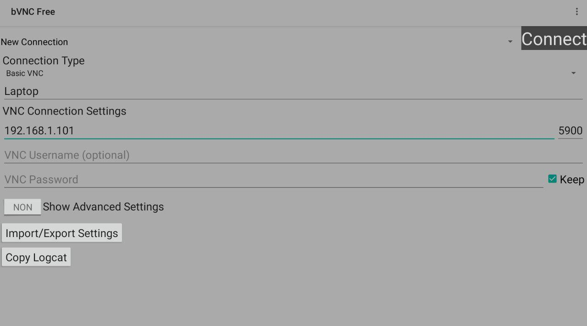

# Tutorial

Do you have any old **Android tablet** at home? Then you have a new **second screen** for your laptop! With this tutorial you will be able to use any Android device to extend your screen on Linux. For this purpose we are going to use a wireless connection, but it can also be done through a USB cable.

> I guess this tutorial can also be done with an iPad or other laptop instead of an Android tablet, but I don't have the possibility to check it.

### Test environment
- Laptop with Ubuntu 18.04
- Nvidia Geforce GTX 1660Ti
- Intel Core i7-9750H (Intel UHD Graphics 630)

### Necessary software
- In the computer:
	- a VNC server (as for example _x11vnc_)
	```
	sudo apt install x11vnc
	```
- In the tablet:
	- a VNC client app: I recommend you [_bVNC Free_](https://play.google.com/store/apps/details?id=com.iiordanov.freebVNC&hl=en) because it has more security options than other apps.


## Workaround

### 1. Get some information

Firt we need to know available displays and output ports.
```
xrandr
```

The output should be something like this (I removed some entries because the output was very long):
```
Screen 0: minimum 8 x 8, current 1920 x 1080, maximum 32767 x 32767
HDMI-0 disconnected primary (normal left inverted right x axis y axis)
eDP-1-1 connected 1920x1080+0+0 (normal left inverted right x axis y axis) 344mm x 194mm
   1920x1080    144.00*+  60.01    59.97    59.96    59.93  
   1680x1050     84.94    74.89    69.88    59.95    59.88  
   1600x1024     60.17  
   1400x1050     85.00    74.76    70.00    59.98  
   1600x900      59.99    59.94    59.95    59.82  
   1280x1024     85.02    75.02    60.02  
   1440x900      59.89  
   [...]
   480x270       59.63    59.82  
   400x300       85.27    72.19    75.12    60.32    56.34  
   432x243       59.92    59.57  
   320x240       85.18    72.81    75.00    60.05  
   360x202       59.51    59.13  
   360x200       85.04  
   320x200       85.27  
   320x180       59.84    59.32  
   320x175       85.27  
DP-1-1 disconnected (normal left inverted right x axis y axis)
HDMI-1-1 disconnected (normal left inverted right x axis y axis)
```
As you can see, my current display is `eDP-1-1` with the resolution _1920x1080 144.00Hz_. The unused output ports are `HDMI-0`, `DP-1-1` and `HDMI-1-1`. You may have a different output ports and resolutions depending on your graphic card.

### 2. Create a new virtual monitor

We need to know the tablet's resolution. In my case is _1280x800_. 

> If you don't know your tablet's resolution, visit [this site](https://whatismyandroidversion.com) from your tablet's web browser and it will show you your screen resolution. If it is different from mine you will have to replace it in all the commands.

Generate modeline for the resolution of the VPN screen. Run in terminal:
```
gtf 1280 800 60
```
> _60_ is the **screen refresh rate** for the tablet

The modeline generated by this command is:
```
# 1280x800 @ 60.00 Hz (GTF) hsync: 49.68 kHz; pclk: 83.46 MHz
  Modeline "1280x800_60.00"  83.46  1280 1344 1480 1680  800 801 804 828  -HSync +Vsync

```

Copy everything after the word `Modeline` (exclude it) into the next command. Now let's add a new mode for our Android device:

```
xrandr --newmode "1280x800_60.00"  83.46  1280 1344 1480 1680  800 801 804 828  -HSync +Vsync
```
> **Note**: xrandr means X Resize and Rotate    (just a curiosity)

Add this new mode to an unused output port. `HDMI-1-1` in this case.
> You can try the output ports that work for you.

```
xrandr --addmode HDMI-1-1 1280x800_60.00
```

Now let’s enable `HDMI-1-1` and move it to the left of the default display (`eDP-1-1`). After this mouse cursor can be moved to the left side more than your default display allows. It is because we are adding 1280×800 to the left side of `eDP-1-1`.

```
xrandr --output HDMI-1-1 --mode 1280x800_60.00 --left-of eDP-1-1
```
> If you want to put the second screen in the right side of the default display just change the option `--left-of` by `--right-of`.

The final step is to start the VNC server:
```
x11vnc -clip 1280x800+0+0
```

Now you need to connect your Android device using a VNC client. To do so you need an IP and port. To find your computer's IP run:
```
ip a
```

In my case it is 192.168.1.67. The **default port** in VNC is **5900** unless you changed it.


_Screenshot of the bVNC Free app_

### 3. Disable the second screen

After stopping the VNC server you need to disable the second screen `HDMI-1-1`:
```
xrandr --output HDMI-1-1 --off
```

### Summary

Every time you reboot the computer you will have to add the modeline again. Then I will make a summary of all the commands used in this tutorial:
```
# Create the virtual monitor (every time after rebooting the computer)
xrandr --newmode "1280x800_60.00"  83.46  1280 1344 1480 1680  800 801 804 828  -HSync +Vsync
xrandr --addmode HDMI-1-1 1280x800_60.00

# Enable the second display
xrandr --output HDMI-1-1 --mode 1280x800_60.00 --left-of eDP-1-1
x11vnc -clip 1280x800+0+0

# Disable
xrandr --output HDMI-1-1 --off
```

### Clean modes

To remove the mode:
```
xrandr --output HDMI-1-1 --off
xrandr --delmode HDMI-1-1 "1280x800_60.00"
xrandr --rmmode "1280x800_60.00"
```

### Check displays and modes
```
xrandr -q
```

## Notices

- Data is unencrypted! (Relevant for public network connections)
- Any network you are connected that can reach port 5900 can connect to your monitor! (Not a problem if using a USB connection)

Due to this you should use some security options when using x11vnc.

## Add more security to the connection

### Change the port of the connection

By default x11vnc use the port 5900. We can change it by running the following command:
```
x11vnc -rfbport <port_number>
```
If something else is using that port x11vnc will exit immediately.


### Establish a password for the connection

You can use one of the following commands:
```
x11vnc -storepasswd password /path/to/passfile
x11vnc -storepasswd /path/to/passfile
x11vnc -storepasswd
# The last one will save the password in ~/.vnc/passwd
```
And then start x11vnc via:
```
x11vnc -rfbauth /path/to/passfile
```

Or run 
```
x11vnc -usepw
```
It automatically use your ~/.vnc/passwd or ~/.vnc/passwdfile password files. Under -usepw, x11vnc will exit if it cannot find a password to use. 

**WARNING**: Even with a password, the subsequent VNC traffic is sent in the clear. **Solution** => SSL connection.


### Use a SSL connection or Tunneling

Consider tunnelling via ssh: http://www.karlrunge.com/x11vnc/#tunnelling

Or using the x11vnc SSL options: `-ssl` and `-stunnel`

The `-ssl` mode requires an SSL certificate and key (i.e. .pem file). These are usually created via the openssl program. In fact when you run the `-ssl` option (same as "-ssl SAVE") it will run openssl for you automatically. It will prompt you if you want to protect it with a passphrase. In general, the PEM file contains both the Certificate (i.e. public key) and the Private Key, so it should be protected from being read by untrusted users. The best way to do this is to encrypt the key with a passphrase (note however this requires supplying the passphrase each time x11vnc is started up).

Example:
```
x11vnc -ssl SAVE ...
```
This way it will be saved in the default directory ~/.vnc/certs/ as server.crt (the certificate only) and server.pem (both certificate and private key.) This opens up the possibility of copying the server.crt to machines where the VNC Viewer will be run to enable authenticating the x11vnc SSL VNC server to the clients.

> If you are using the _bVNC Free_ app in the Android device, go to the _Connection Type_ menu and select the _Secure VNC over SSL Tunnel_ option.


### Limit which machines can connect to the VNC server

With the `-allow` option we can limit connections by hostname or IP address. Example:
```
x11vnc -allow 192.168.0.1,192.168.0.2
```

Or use `-localhost`, that achieves the same thing as `-allow 127.0.0.1`


[More information about security](http://www.karlrunge.com/x11vnc/faq.html#faq-passwd)


## Known issues

- Often having a Firewall/Router sitting between the vncviewer and x11vnc will make it impossible for the viewer to connect to x11vnc. [(+info)](http://www.karlrunge.com/x11vnc/index.html#firewalls)

------------------------------------

## Resources I used to create this tutorial

- https://sangams.com.np/using-android-pc-as-a-second-monitor-in-linux
- https://askubuntu.com/a/750497
- https://github.com/brunodles/linux-second-screen/blob/master/tutorial.md

**X11vnc** is a really powerful tool. I strongly recommend you to take a look at the [**documentation**](http://www.karlrunge.com/x11vnc)